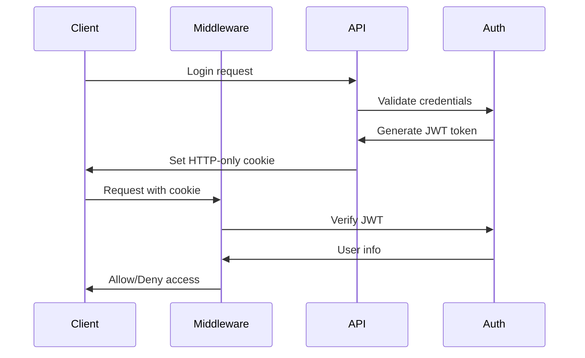

# Security Documentation

## Overview

This document outlines the security measures implemented in the Forensics application and provides guidelines for maintaining security standards.

## Critical Security Issues Found and Addressed

### 1. Authentication and Authorization

#### Issues Found:
- ❌ Admin wallet address hardcoded in source code
- ❌ Authentication tokens stored in localStorage (vulnerable to XSS)
- ❌ Client-side role validation (can be manipulated)
- ❌ Predictable token generation using timestamps

#### Solutions Implemented:
- ✅ Moved admin wallet address to environment variables
- ✅ Implemented secure HTTP-only cookie authentication
- ✅ Added server-side JWT token validation
- ✅ Implemented cryptographically secure token generation
- ✅ Added proper session management

### 2. API Security

#### Issues Found:
- ❌ Missing input validation and sanitization
- ❌ No rate limiting on API endpoints
- ❌ API credentials exposed in client-side code
- ❌ Missing CSRF protection

#### Solutions Implemented:
- ✅ Comprehensive input validation with `ApiValidator` class
- ✅ Rate limiting implementation
- ✅ Proper API credential management
- ✅ CSRF token generation and validation
- ✅ Request sanitization

### 3. Build and Configuration Security

#### Issues Found:
- ❌ TypeScript and ESLint errors ignored during builds
- ❌ Missing security headers
- ❌ Dependencies pinned to "latest" versions

#### Solutions Implemented:
- ✅ Security headers middleware
- ✅ Content Security Policy (CSP)
- ✅ Build configuration recommendations

## Security Architecture

### Authentication Flow



### Security Layers

1. **Transport Security**: HTTPS only in production
2. **Authentication**: JWT tokens in HTTP-only cookies
3. **Authorization**: Server-side role validation
4. **Input Validation**: Comprehensive request validation
5. **Rate Limiting**: Per-IP and per-endpoint limits
6. **Security Headers**: CSP, XSS protection, etc.
7. **CSRF Protection**: Token-based validation

## Security Configuration

### Environment Variables

```bash
# Copy .env.example to .env and configure these values:

# Admin Configuration
ADMIN_WALLET_ADDRESS=your-admin-wallet-address

# JWT Configuration
JWT_SECRET=your-super-secure-jwt-secret-here-at-least-64-characters-long
JWT_EXPIRE_TIME=24h

# Session Configuration
SESSION_SECRET=your-super-secure-session-secret-here
SESSION_EXPIRE_TIME=86400

# Security Settings
SECURE_COOKIES=true
SAME_SITE_COOKIES=strict
HTTPS_ONLY=true

# Rate Limiting
RATE_LIMIT_WINDOW_MS=900000
RATE_LIMIT_MAX_REQUESTS=100
```

### Security Headers

The application implements the following security headers:

- `X-Frame-Options: DENY` - Prevents clickjacking
- `X-Content-Type-Options: nosniff` - Prevents MIME type sniffing
- `X-XSS-Protection: 1; mode=block` - Enables XSS filtering
- `Referrer-Policy: strict-origin-when-cross-origin` - Controls referrer info
- `Content-Security-Policy` - Prevents code injection attacks

## Usage Guidelines

### Using Secure Authentication

```typescript
import { SecureAuth } from '@/lib/auth-secure'

// Create authentication token
const token = await SecureAuth.createAuthToken(walletAddress)

// Verify token
const user = await SecureAuth.verifyAuthToken(token)

// Check admin privileges
const isAdmin = SecureAuth.isAdmin(user)
```

### API Validation

```typescript
import { ApiValidator } from '@/lib/api-validator'

export async function POST(request: NextRequest) {
  const validation = await ApiValidator.validateRequest(request, {
    requireAuth: true,
    rateLimit: { maxRequests: 10, windowMs: 60000 },
    body: [
      { field: 'address', type: 'wallet', required: true },
      { field: 'amount', type: 'number', min: 0, max: 1000000 },
    ],
  })

  if (!validation.success) {
    return ApiValidator.createResponse(false, null, validation.error, 400)
  }

  // Process validated data
  const { address, amount } = validation.data.body
  // ...
}
```

### Input Sanitization

```typescript
import { SecureAuth } from '@/lib/auth-secure'

// Sanitize user input
const sanitizedInput = SecureAuth.sanitizeInput(userInput)

// Validate wallet address
const isValid = SecureAuth.isValidSolanaAddress(address)
```

## Security Checklist

### Before Deployment

- [ ] All environment variables configured securely
- [ ] JWT secrets are cryptographically secure (64+ characters)
- [ ] Admin wallet address moved to environment variables
- [ ] HTTPS enforced in production
- [ ] Security headers properly configured
- [ ] Rate limiting enabled
- [ ] Input validation implemented on all endpoints
- [ ] Dependencies updated to secure versions
- [ ] Build errors not ignored
- [ ] Proper logging and monitoring configured

### Regular Security Maintenance

- [ ] Run security audit tool monthly
- [ ] Update dependencies regularly
- [ ] Review access logs for suspicious activity
- [ ] Rotate JWT secrets periodically
- [ ] Monitor for new security vulnerabilities
- [ ] Review and update security policies

## Security Audit Tool

The application includes a comprehensive security audit tool:

```bash
# Run security audit
node security-audit.js

# Check for specific vulnerabilities
npm audit

# Update vulnerable dependencies
npm audit fix
```

## Incident Response

### If Security Breach Detected:

1. **Immediate Actions**:
   - Disable affected accounts
   - Rotate all secrets and tokens
   - Block suspicious IP addresses
   - Document the incident

2. **Investigation**:
   - Analyze logs for breach scope
   - Identify affected data
   - Determine attack vector

3. **Recovery**:
   - Patch vulnerabilities
   - Restore from clean backups if needed
   - Update security measures

4. **Post-Incident**:
   - Update security policies
   - Conduct security training
   - Improve monitoring

## Compliance and Standards

### Standards Followed:
- OWASP Top 10 Web Application Security Risks
- CWE (Common Weakness Enumeration) guidelines
- NIST Cybersecurity Framework

### Security Testing:
- Static Application Security Testing (SAST)
- Input validation testing
- Authentication and authorization testing
- Session management testing

## Contact and Support

For security-related issues or questions:
- Report security vulnerabilities through secure channels
- Follow responsible disclosure practices
- Keep security discussions confidential until resolved

## References

- [OWASP Web Application Security Testing Guide](https://owasp.org/www-project-web-security-testing-guide/)
- [NIST Cybersecurity Framework](https://www.nist.gov/cyberframework)
- [CWE Common Weakness Enumeration](https://cwe.mitre.org/)
- [Next.js Security Guidelines](https://nextjs.org/docs/advanced-features/security-headers)